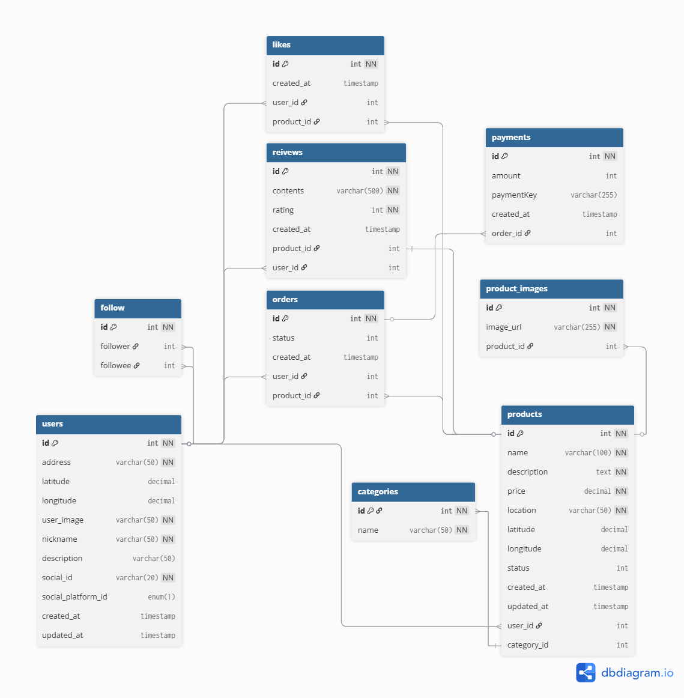

# 🏭️ VVolt Market (NestJS)

📆 **개발 기간**: 2025.07.23 ~ 2025.07.31 (1차 개발) <br/>
🚀 **배포 주소**: [https://vvolt-market.kr/api-docs](https://vvolt-market.kr/api-docs)

---

## 🏆 프로젝트 개요

**VVolt Market**은 사용자 간 중고 거래를 지원하는 웹 플랫폼입니다.<br/>
NestJS 기반으로 서버를 재구현하여 **API 응답 표준화**, **Docker 기반 CI/CD**, **AWS 인프라 배포 자동화** 등 확장성과 안정성을 강화했습니다.

---

## ⚙️ 기술 스택

### 🔧 Backend

- **NestJS**, **TypeORM**, **MySQL**
- **Docker / Docker Compose**
- **PM2**, **Swagger**, **GitHub Actions**

### ☁️ Infra & DevOps

- **AWS EC2, RDS, S3**
- **Nginx 프록시 설정**
- **환경 변수 관리 (GitHub Secrets)**
- **Github Action 을 통한 CI/CD 자동화 (build → deploy)**

---

## 🔗 주요 API 엔드포인트

| 메서드 | URI                        | 설명                                         |
| ------ | -------------------------- | -------------------------------------------- |
| GET    | `/api/health`              | 서버 상태 확인용                             |
| POST   | `/api/auth/kakao-login`    | 카카오 소셜 로그인 (JWT 발급, 회원가입 여부) |
| POST   | `/api/users/signup`        | 회원가입                                     |
| GET    | `/api/users/:userId`       | 내 정보 및 특정 사용자 정보 조회             |
| PUT    | `/api/users/me`            | 내 정보 수정                                 |
| GET    | `/api/categories`          | 상품 카테고리 전체 조회                      |
| POST   | `/api/products`            | 상품 등록                                    |
| GET    | `/api/products`            | 상품 목록                                    |
| POST   | `/api/products/image`      | 상품 이미지 업로드 (다중)                    |
| GET    | `/api/products/:productId` | 상품 상세 조회                               |
| PUT    | `/api/products/:productId` | 상품 정보 수정                               |
| DELETE | `/api/products/:productId` | 상품 삭제                                    |
| POST   | `/api/likes/:productId`    | 상품 찜(좋아요) 등록/삭제 (toggle)           |
| POST   | `/api/tosspayment/confirm` | 토스 결제 승인                               |
| GET    | `/api/likes/:userId`       | 특정 사용자가 찜한 상품 목록 조회            |
| POST   | `/api/follow/:followeeId`  | 특정 사용자 팔로우/언팔로우 (toggle)         |
| GET    | `/api/follow/:userId`      | 특정 사용자가 팔로우한 유저 목록             |
| GET    | `/api/orders`              | 내 주문 목록 조회                            |
| POST   | `/api/review`              | 후기 등록                                    |
| GET    | `/api/review/:userId`      | 특정 사용자의 후기 목록                      |
| DELETE | `/api/review/:reviewId`    | 내 후기 삭제                                 |

## ⚙️ 공통 모듈 설계

- **JWT 인증 가드 (`JwtAuthGuard`)**  
  모든 보호된 라우터에 일관된 인증 처리를 제공하며, 클레임 정보(req.user)에 접근 가능

- **S3 업로드 인터셉터 (`S3SingleInterceptor`, `S3MultipleInterceptor`)**  
  단일/다중 이미지 업로드를 AWS S3로 처리하며, NestJS 인터셉터 구조로 재사용성과 모듈화를 강화

- **전역 예외 필터 (`GlobalHttpExceptionFilter`)**  
  예상하지 못한 런타임 에러에 대해 `{ code, message }` 포맷의 `E500` 응답을 반환하며,  
  예외 발생 시 `winston` 기반 로그를 남겨 서버 로그로 추적 가능하게 구성.  
  또한, `ErrorCode` enum으로 예외 유형을 구분하여 방어코드에서도 재사용 가능하도록 설계

- **성공 응답 포맷 유틸 (`successResponse`)**  
  모든 API에서 일관된 응답 구조(`{ code, message, data? }`)를 유지하기 위해 공통 응답 유틸로 분리  
  성공 시 필요한 데이터만 유연하게 포함하고, 메시지도 상황에 따라 커스텀 가능

---

## 👩‍💻 DB 모델링



---

## 📀 데모

- 📺 [시연 영상 링크](https://www.youtube.com/watch?v=UDNfYsCpGR4) _(예시)_
- 📄 [API 문서](https://vvolt-market.kr/api-docs) _(Swagger 기반)_

---

## 📂 주요 폴더 구조

```bash
src/
├── auth/              # JWT 인증 모듈
├── categories/        # 카테고리 목록
├── follow/            # 팔로우 기능
├── likes/             # 찜(좋아요) 기능
├── orders/            # 주문 기능
├── products/          # 상품 등록, 조회, 수정, 삭제
├── review/            # 후기 등록, 조회, 삭제
├── tosspayment/       # Toss 결제 기능
├── users/             # 사용자(상점) 정보
├── common/            # 공통 응답 포맷, 인터셉터, 유틸, 예외처리
```

---

## 🚀 배포 및 운영 방식

- **Docker Compose 기반 개발환경 구축**
- `Dockerfile` 작성 → GitHub Actions로 자동 배포
- AWS EC2 인스턴스에서 컨테이너 운영
- `PM2`를 통해 프로세스 상태 관리
- Nginx를 이용한 프록시 라우팅(`/api` → Nest 서버)

---

## 🔧 향후 개선 계획

- React 기반 프론트엔드 추가 배포 (Nest 응답 포맷에 맞게 수정)
- 유닛 테스트 및 E2E 테스트 도입 → CI 파이프라인에 테스트 단계 추가 예정
- Redis로 사용자 정보 캐싱
- Refresh Token 인증 플로우 도입
- AWS Lambda 활용 이미지 썸네일 생성
- 주문 및 배송 관련 API 구현

---

## 🛠️ 협업 및 도구

- GitHub, GitHub Actions
- Notion
- Postman, Swagger

---

## ⚠️ 주의사항

이 프로젝트는 학습용으로 제작되었으며, 실제 운영환경과는 차이가 있을 수 있습니다.<br/>
해당 코드를 무단으로 복제하거나 상업적으로 사용하는 행위는 금지됩니다.

---
